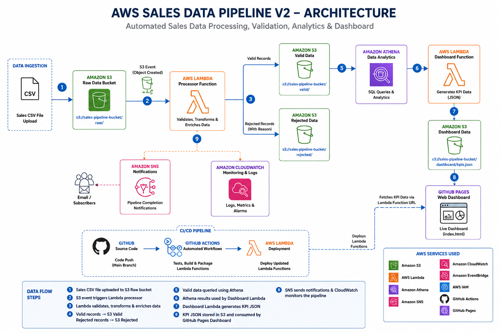

# AWS Sales Data Pipeline V2

An automated, serverless sales data pipeline built with AWS for ingesting, validating, transforming, storing, and analyzing retail sales data.

## Project Overview

This project demonstrates an end-to-end serverless data engineering workflow using AWS.

A CSV sales file is uploaded to Amazon S3. The upload triggers an AWS Lambda function that validates and transforms the records, separates valid and rejected data, stores the results in Amazon S3, and sends a completion notification through Amazon SNS.

Amazon Athena is then used to analyze the processed data. A second Lambda function generates dashboard data, which is consumed by a live dashboard hosted on GitHub Pages.

## Architecture

The pipeline follows this flow:

CSV Upload → Amazon S3 → AWS Lambda → Valid/Rejected S3 Data → Amazon Athena → Dashboard Lambda → Live Dashboard

Supporting services include Amazon SNS, Amazon CloudWatch, Amazon EventBridge, IAM, and GitHub Actions.

The complete architecture diagram is shown below:

## AWS Services Used

| Service | Purpose |
|---|---|
| Amazon S3 | Stores raw, valid, rejected, dashboard, and Athena result data |
| AWS Lambda | Processes sales records and generates dashboard data |
| Amazon Athena | Performs SQL analytics on processed data |
| Amazon SNS | Sends pipeline completion notifications |
| Amazon EventBridge | Supports event-based and scheduled automation |
| Amazon CloudWatch | Provides execution logs and monitoring |
| AWS IAM | Controls access to AWS resources |
| GitHub Actions | Runs automated tests and deploys Lambda functions |
| GitHub Pages | Hosts the live analytics dashboard |

## Data Processing Workflow

1. A CSV sales file is uploaded to the `raw/` folder in Amazon S3.
2. The S3 upload triggers the processing Lambda function.
3. Lambda reads the CSV file from S3.
4. Each record is validated.
5. Valid records are transformed and enriched with a calculated `Revenue` field.
6. Valid records are written to the `valid/` S3 folder.
7. Invalid records are written to the `rejected/` S3 folder with a rejection reason.
8. Amazon SNS sends a pipeline completion notification.
9. The dashboard Lambda queries Amazon Athena.
10. Dashboard KPI data is generated and stored as `dashboard/kpis.json`.
11. The live GitHub Pages dashboard retrieves the latest data through the Lambda Function URL.

## Data Validation

The pipeline performs data-quality checks before accepting a record.

Validation checks include:

- Missing `InvoiceNo`
- Missing `Quantity`
- Missing `UnitPrice`
- Quantity less than or equal to zero
- Unit price less than or equal to zero
- Empty records

Valid records receive:

`ValidationStatus = VALID`

Rejected records receive:

`ValidationStatus = REJECTED`

Rejected records also contain a `RejectionReason` field explaining why the record failed validation.

## Data Transformation

For valid records, the pipeline:

- Converts `Quantity` to a numeric value
- Converts `UnitPrice` to a numeric value
- Calculates revenue using:

`Revenue = Quantity × UnitPrice`

- Rounds revenue to two decimal places
- Adds a validation status
- Preserves the original sales fields

## Test Dataset

The pipeline was tested using a retail sales CSV containing **50,000 records**.

### Validation Results

| Metric | Result |
|---|---:|
| Total processed | 50,000 |
| Valid records | 48,780 |
| Rejected records | 1,220 |
| Valid percentage | 97.56% |
| Rejected percentage | 2.44% |

### Rejection Breakdown

| Rejection Reason | Records |
|---|---:|
| Quantity must be greater than zero | 1,008 |
| UnitPrice must be greater than zero | 212 |
| **Total rejected** | **1,220** |

## Sales Analytics

The processed data is queried using Amazon Athena.

### Key Performance Indicators

| KPI | Result |
|---|---:|
| Total transactions processed | 50,000 |
| Valid transactions | 48,780 |
| Total revenue | £955,346.88 |
| Average transaction value | £19.58 |

### Revenue by Country

The United Kingdom generated the highest revenue in the test dataset, followed by Germany, France, EIRE, and the Netherlands.

### Top Products by Revenue

The highest-revenue products included:

1. REGENCY CAKESTAND 3 TIER
2. DOTCOM POSTAGE
3. AMAZONFEE
4. WHITE HANGING HEART T-LIGHT HOLDER
5. CHILLI LIGHTS

### Monthly Revenue

The test dataset contains sales activity across December 2010 and January 2011, with December generating the majority of the recorded revenue.

## Live Dashboard

The project includes a live analytics dashboard hosted using GitHub Pages.

The dashboard displays:

- Total processed transactions
- Valid transactions
- Rejected transactions
- Total revenue
- Average transaction value
- Validation percentages
- Revenue by country
- Monthly revenue
- Top 10 products by revenue

The dashboard retrieves its data dynamically from AWS through an AWS Lambda Function URL.

## Automation

The pipeline was designed to minimize manual intervention.

    CSV Upload
         ↓
    Amazon S3
         ↓
    AWS Lambda Processor
         ↓
    Valid / Rejected Data
         ↓
    Amazon Athena
         ↓
    Dashboard Lambda
         ↓
    dashboard/kpis.json
         ↓
    GitHub Pages Dashboard

Amazon SNS provides completion notifications, while CloudWatch provides Lambda execution logs and monitoring.

## CI/CD

GitHub Actions is used for automated testing and Lambda deployment.

The repository contains workflows for:

- Running Python tests
- Installing project dependencies
- Packaging Lambda functions
- Deploying Lambda functions to AWS

Changes pushed to the `main` branch trigger the configured workflow.

## Testing

Automated tests are written using `pytest`.

GitHub Actions runs the test suite automatically and deploys the Lambda functions when the workflow completes successfully.

The project test workflow passed successfully during development.

## Repository Structure

    aws-sales-data-pipeline-v2/
    │
    ├── .github/
    │   └── workflows/
    │       ├── tests.yml
    │       └── build-lambda.yml
    │
    ├── docs/
    │   └── architecture/
    │       ├── README.md
    │       └── aws-sales-data-pipeline-v2-architecture.png
    │
    ├── src/
    │   └── pipeline/
    │       ├── dashboard/
    │       │   ├── __init__.py
    │       │   └── lambda_function.py
    │       │
    │       ├── __init__.py
    │       ├── lambda_function.py
    │       ├── processor.py
    │       ├── s3_reader.py
    │       ├── s3_writer.py
    │       └── validator.py
    │
    ├── tests/
    │
    ├── index.html
    ├── requirements.txt
    └── README.md

## Key Engineering Concepts Demonstrated

- Serverless data processing
- Event-driven architecture
- Data validation
- Data transformation
- Data quality handling
- Amazon S3 object storage
- SQL analytics with Amazon Athena
- AWS Lambda development
- Amazon SNS notifications
- IAM permissions
- CloudWatch monitoring
- CI/CD with GitHub Actions
- Lambda Function URLs
- Dashboard development
- GitHub Pages deployment

## Future Improvements

Potential improvements include:

- Streaming or chunked processing for larger CSV files
- More granular IAM permissions following least-privilege principles
- Additional dashboard visualizations
- Data partitioning for improved Athena performance
- Automated data-quality reports
- Infrastructure as Code using AWS CloudFormation or Terraform
- Additional integration tests
- Historical pipeline run tracking

## Project Outcome

This project demonstrates an end-to-end AWS data engineering workflow that takes raw sales data from ingestion through validation, transformation, storage, analytics, and visualization.

The implementation successfully processed 50,000 sales records, separated valid and rejected data, generated analytical KPIs using Amazon Athena, automatically updated dashboard data, sent pipeline completion notifications, and delivered the results through a live web dashboard.

---

**Author:** Faith Ogundusi  
**Focus:** AWS Cloud | Data Engineering | Serverless Data Pipelines
